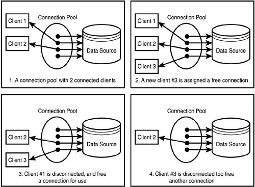

## Connection Pool

[REf](https://stackoverflow.com/questions/4041114/what-is-database-pooling)

Database connection pooling is a method used to keep database connections open so they can be reused by others.

Pooling keeps the connections active so that, when a connection is later requested, one of the active ones is used in preference to having to create another one.

### key points 

Pool : reusability ( you dont have to create a connection (object) to DB for each request from client )

  

## Idle Time and wait timeout
[Ref](https://stackoverflow.com/questions/9451818/what-is-the-difference-between-maxactive-vs-maxidle-for-tomcat-connection-pools)
[Ref](https://stackoverflow.com/questions/24565274/c3p0-maxidletime-is-same-as-wait-timeout-of-mysql)
## maxIdleTime
(Default: 0) Seconds a Connection can remain pooled but unused before being discarded. Zero means idle connections never expire.

## wait_timeout
the amount of seconds during inactivity that DATABASE will wait before it will close a connection on a non-interactive connection in seconds. 

example: connected from java. connections are in sleep state.

## `maxActive`
the maximum number of active connections that can be allocated from this pool at the same time.  

## `maxIdle`
(int) The maximum number of connections that should be kept in the pool **at all times.** 

This is to limit the idle connections. 

The connections(not larger than the value of maxIdle) will not be released so that the next request for connections will be much faster.

So in a word, maxActive is to limit max connections.

But idle(maxIdle or minIdle) is more for performance issue(exchange time with space/resources) , among which, the maxIdle is to limit the max connections(the resources) that you are going to exchange time with.

For example   
say you have 100 max Active connections and say you set maxIdle to 80. 

**Assuming there are no requests going to the database, only 80 connections will be tested (via the validation query) and will stay active.**  
The other 20 will be closed. So at any point you can only have 80 idle connections.   

- Set these two to be a different number to prevent additional (unnecessary) connections going out to the database. Cos every connection that is served by the database consumes resources (like memory). But, assuming you have set the maxActive size to 100 and all 100 are in use almost all the time, this setting will obviously not matter.
